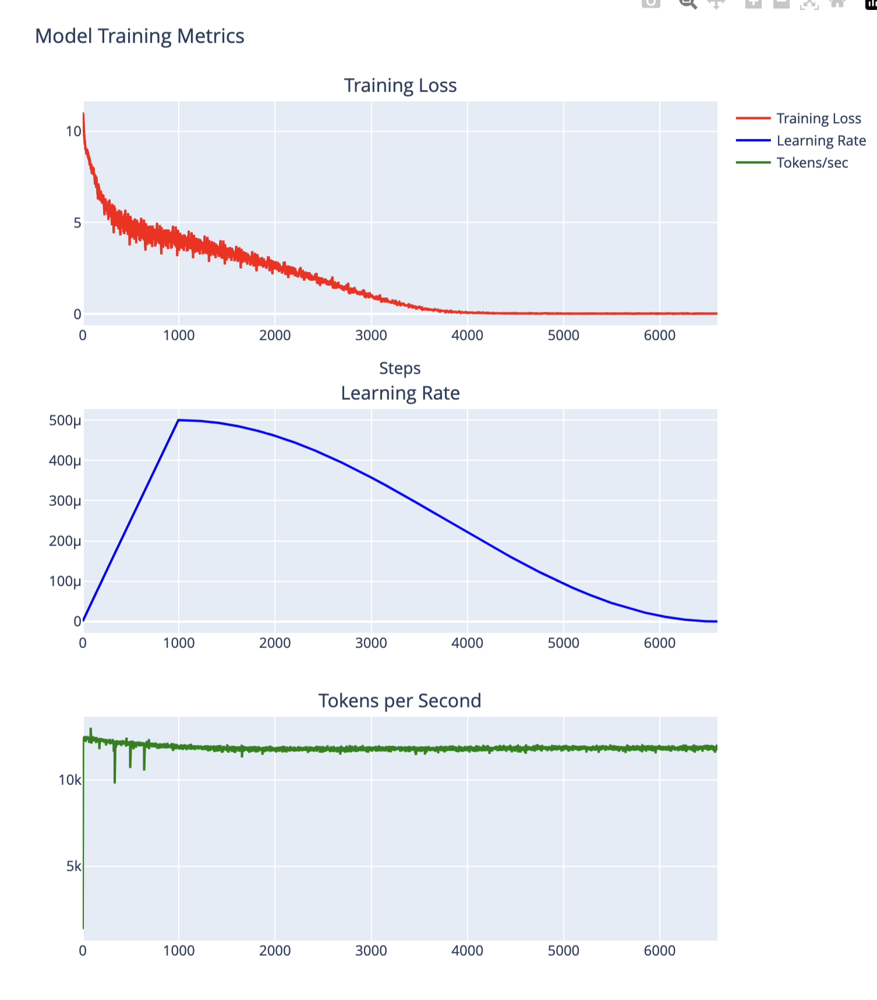

# Custom GPT Model

This repository contains a custom GPT model implementation trained for text generation. The model is based on the GPT-2 architecture and can be used for next token prediction and text generation tasks.

## Demo Interface


The web interface provides:
- **Generation Parameters**:
  - Max Length: Control the length of generated text (10-200 tokens)
  - Number of Sequences: Generate multiple variations (1-5)
  - Temperature: Adjust creativity (0.1-2.0, higher = more random)
- **Input Area**: Enter your prompt text
- **Generated Text**: View multiple generated sequences
- **Model Information**: Quick reference to model architecture

## Model Architecture
- Base Architecture: GPT-2
- Number of Layers: 12
- Number of Heads: 12
- Embedding Dimension: 768
- Vocabulary Size: 50,257 (GPT-2 tokenizer)
- Maximum Sequence Length: 1024

## Setup

1. Create and activate virtual environment:
```bash
python -m venv venv
source venv/bin/activate  # On Windows: venv\Scripts\activate
```

2. Install dependencies:
```bash
pip install -r requirements.txt
```

3. Set up environment variables:
```bash
# Copy example environment file
cp .env.example .env

# Edit .env file with your Hugging Face token
# Replace 'your_huggingface_token_here' with your actual token
```

## Running the Web Interface

Start the Streamlit app locally:
```bash
streamlit run app.py
```

The interface will be available at http://localhost:8501

## Usage

### Text Generation

```python
from model import generate_text, load_model

# Load the model
model = load_model("gpt-config.pth")

# Generate text
prompt = "Once upon a time"
generated_text = generate_text(
    text=prompt,
    model=model,
    max_length=50,
    num_return_sequences=3
)
print(generated_text)
```

## Model Weights
The model weights are stored in `gpt-config.pth`. The model uses the GPT-2 tokenizer for encoding/decoding text.

## Training Metrics
- Final Loss: ~3.8
- Training Speed: ~12,000 tokens/sec on GPU

### Training Progress Visualization


The training metrics show:
- **Training Loss**: Decreased from ~11 to ~0.02, indicating good model convergence
- **Learning Rate**: Peaked at ~500μ before gradual decay, following a cosine schedule
- **Tokens/sec**: Maintained steady throughput of ~12,000 tokens/second on GPU

Key observations:
- Model converged after ~4000 steps
- Loss stabilized around step 4000
- Consistent processing speed throughout training

## Project Structure
```
your_project/
├── README.md
├── requirements.txt
├── model.py
├── upload_to_hub.py
└── gpt-config.pth
```